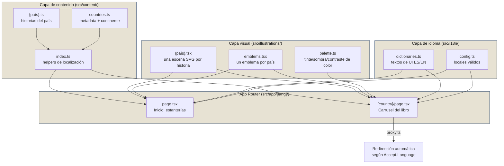

<div align="center">

# 📖 The Culture Atlas

**Un atlas cultural digital, país por país, página por página.**

Un libro ilustrado interactivo donde cada país del mundo tiene su propia "estantería": una portada, un lomo con su emblema, y páginas con historias breves sobre su cultura — comida, tradiciones, música, lugares, curiosidades — acompañadas de ilustraciones SVG generadas para cada entrada.

[](https://nextjs.org)
[](https://react.dev)
[](https://www.typescriptlang.org)
[](https://mui.com)
[](#-internacionalización)

</div>

---

## 🧭 Índice

- [¿Qué es esto?](#-qué-es-esto)
- [Cómo se ve la experiencia](#-cómo-se-ve-la-experiencia)
- [Stack técnico](#-stack-técnico)
- [Arquitectura](#-arquitectura)
- [Estructura del proyecto](#-estructura-del-proyecto)
- [Modelo de contenido](#-modelo-de-contenido)
- [Sistema de ilustraciones](#-sistema-de-ilustraciones)
- [Ficha de datos rápidos](#-ficha-de-datos-rápidos)
- [Internacionalización](#-internacionalización)
- [Cómo agregar un país nuevo](#-cómo-agregar-un-país-nuevo)
- [Empezar a desarrollar](#-empezar-a-desarrollar)
- [Estado del proyecto](#-estado-del-proyecto)

---

## 📚 ¿Qué es esto?

**The Culture Atlas** (*Atlas de la Cultura*) es un sitio web que presenta el mundo como una biblioteca: cada país es un libro en una estantería, agrupado por continente. Al abrir un país, se navega como un libro real —portada, luego páginas— donde cada página cuenta una historia corta sobre algún aspecto de su cultura, con una ilustración a página completa.

El objetivo final del proyecto es cubrir **los ~195 países del mundo**, con **20 historias cada uno** (≈3900 historias en total), todo bilingüe (ES/EN) y con ilustraciones propias.

> ⚠️ El contenido se genera con asistencia de IA y puede contener imprecisiones — no reemplaza fuentes verificadas. Este aviso también se muestra en el pie del sitio.

## 🖼️ Cómo se ve la experiencia

```
┌─────────────────────────────┐        ┌──────────────────────────────────────────┐
│        Página de inicio      │        │              Página de país                │
│                               │  clic  │                                            │
│   ✦ Estanterías por          │ ─────▶ │  ┌───────────┐  ┌────────────────────┐    │
│     continente                │        │  │           │  │  Chip · Título      │    │
│   🇦🇷 🇧🇷 🇫🇷 🇯🇵 🇰🇪 ...        │        │  │  SVG      │  │  Descripción breve  │    │
│   Buscador de países          │        │  │  ilustrada │  │  # de página         │    │
│                               │        │  └───────────┘  └────────────────────┘    │
└─────────────────────────────┘        │        ◀  carrusel tipo libro  ▶            │
                                         └──────────────────────────────────────────┘
```

- **Inicio (`/[lang]`)** — estanterías (`ShelfRow`) agrupadas por continente, con buscador (`CountrySearch`) y chips de navegación rápida (`ContinentChips`). Cada país se ve como un lomo de libro 3D (`BookCover`) con su color de acento y emblema.
- **Página de país (`/[lang]/[país]`)** — un carrusel (`BookCarousel`, sobre [Embla Carousel](https://www.embla-carousel.com/)) que simula pasar páginas de un libro: primero la portada (`CoverPage`), luego una página por cada historia (`PageSpread`), con ilustración a la izquierda y texto a la derecha.

## 🛠️ Stack técnico

| Categoría | Tecnología | Uso en el proyecto |
|---|---|---|
| Framework | [Next.js 16](https://nextjs.org) (App Router) | Rutas dinámicas `[lang]/[country]`, generación estática (`generateStaticParams`), metadata dinámica |
| UI | [React 19](https://react.dev) | Componentes de servidor y cliente |
| Lenguaje | [TypeScript 5](https://www.typescriptlang.org) | Tipado estricto de contenido, ilustraciones e i18n |
| Diseño | [MUI 9](https://mui.com) + Emotion | Sistema de componentes, theming, `sx` prop |
| Tipografía | `next/font` — Geist, Geist Mono, Fraunces | Fuente serif (Fraunces) para títulos, sans para cuerpo |
| Carrusel | [Embla Carousel](https://www.embla-carousel.com/) | Efecto de "pasar páginas" en la vista de país |
| Ilustraciones | SVG hechos a mano en React (sin librerías externas) | Una escena única por historia + un emblema por país |
| i18n | Implementación propia (sin librería) | Diccionarios estáticos ES/EN + middleware de detección de idioma |
| Lint | ESLint 9 (`eslint-config-next`) | — |
| Deploy | [Vercel](https://vercel.com) | `metadataBase` apunta a `the-culture-atlas.vercel.app` |

No hay base de datos ni CMS: **todo el contenido vive en el repo como código TypeScript tipado**, lo que hace que agregar un país sea una operación de "agregar archivos", no de administrar infraestructura.

## 🏗️ Arquitectura

El proyecto sigue una arquitectura de **contenido estático tipado + capas independientes** que se combinan solo en el momento de renderizar:



**Principios clave:**

1. **Contenido e ilustración están desacoplados por convención de nombres**, no por referencia directa. `PageSpread` busca la ilustración de una historia con `getIllustration(countrySlug, entryId)` — si no existe, cae a un emoji placeholder. Esto permite escribir el contenido de un país sin bloquear la publicación por falta de ilustraciones.
2. **Todo es server-side y estático por defecto.** Las páginas usan `generateStaticParams` para pre-renderizar cada combinación de idioma × país en build time; solo los componentes interactivos (carrusel, buscador, selector de idioma) son `"use client"`.
3. **El color es el hilo conductor del diseño.** Cada historia tiene un `accentColor` propio; `src/illustrations/palette.ts` deriva tintes, sombras y color de texto legible (WCAG-ish, vía brillo YIQ) a partir de ese único color, sin paletas hardcodeadas por componente.
4. **El idioma nunca se detecta en el cliente.** `src/proxy.ts` intercepta cada request, lee el header `Accept-Language` y redirige a `/es` o `/en` antes de que se renderice nada.

## 🗂️ Estructura del proyecto

```
src/
├── app/
│   └── [lang]/
│       ├── layout.tsx           # Shell: fuentes, header, footer, tema MUI
│       ├── page.tsx             # Inicio: estanterías por continente
│       ├── [country]/page.tsx   # Carrusel del libro de un país
│       ├── opengraph-image.tsx  # OG image dinámica
│       └── icon.tsx / apple-icon.tsx
│
├── components/                  # Componentes de UI (MUI)
│   ├── BookCarousel.tsx         # Carrusel "pasar página" (Embla)
│   ├── BookCover.tsx            # Lomo de libro 3D en la estantería
│   ├── BookPageFrame.tsx        # Marco compartido de una página
│   ├── CoverPage.tsx            # Portada del libro de un país
│   ├── PageSpread.tsx           # Una historia (ilustración + texto)
│   ├── ShelfRow.tsx             # Estantería con scroll horizontal
│   ├── ContinentChips.tsx       # Navegación rápida por continente
│   ├── CountrySearch.tsx        # Buscador de países
│   ├── LanguageSwitcher.tsx     # Selector ES/EN
│   ├── Footer.tsx               # Progreso del proyecto (países/historias)
│   └── ThemeRegistry.tsx        # Setup de MUI + Emotion cache
│
├── content/                     # 🌍 Una fuente de la verdad por país
│   ├── types.ts                 # CultureEntry, Country, Locale, Continent
│   ├── countries.ts             # Metadata de cada país (slug, continente, bandera)
│   ├── index.ts                 # Mapa país→historias + helpers de localización
│   └── {país}.ts                # Array de CultureEntry (10 historias, ES+EN)
│
├── illustrations/
│   ├── types.ts                 # IllustrationDefinition (component + variante)
│   ├── index.ts                 # Mapa país→ilustraciones por id de historia
│   ├── IllustrationFrame.tsx    # Fondo SVG compartido (variante ground/medallion)
│   ├── emblems.tsx              # Emblema SVG único por país (para portada/lomo)
│   ├── palette.ts                # tint / shade / averageColor / readableTextColor
│   └── {país}.tsx                # Escenas SVG, una por historia del país
│
├── i18n/
│   ├── config.ts                 # locales válidos + locale por defecto
│   └── dictionaries.ts           # Textos de UI en ES/EN
│
├── proxy.ts                      # Middleware: detecta idioma y redirige
└── theme.ts                       # Tema MUI (tipografía, paleta base)
```

## 📦 Modelo de contenido

Cada país es un archivo `src/content/{slug}.ts` que exporta un array de **10 historias** (`CultureEntry`), cada una con traducción completa a ambos idiomas:

```ts
export const netherlands: CultureEntry[] = [
  {
    id: "fiets",                 // vincula con la ilustración del mismo id
    order: 1,                    // orden dentro del libro
    accentColor: "#FF6B00",      // define todo el theming de la página
    imageUrl: null,              // foto real opcional; si es null, se usa la ilustración SVG
    placeholderEmoji: "🚲",       // fallback si tampoco hay ilustración
    translations: {
      es: { title, subtitle, description, imageAlt },
      en: { title, subtitle, description, imageAlt },
    },
  },
  // ...9 historias más
];
```

Ese país después se registra en dos lugares más:

- **`src/content/countries.ts`** — metadata liviana (slug, `flagEmoji`, `accentColor`, `continent`, nombre e intro traducidos).
- **`src/content/index.ts`** — se importa y se agrega al mapa `contentByCountry`.

> 📏 **Restricciones de contenido** (para que las páginas —de altura fija— no se rompan visualmente): títulos ≤55 caracteres, descripciones idealmente <850 caracteres (tope duro 1000). Ver el skill `illustrations` del repo para el detalle y el script de auditoría.

## 🎨 Sistema de ilustraciones

No se usan imágenes ni librerías de íconos externas para las escenas: **cada historia tiene su propia ilustración SVG escrita a mano como componente React** en `src/illustrations/{país}.tsx`, con el mismo `id` que su historia en `content/`.

- `IllustrationFrame` dibuja el fondo compartido (dos variantes: `ground` — suelo/horizonte, o `medallion` — círculo central) usando tintes derivados del `accentColor` de la historia.
- `palette.ts` centraliza toda la lógica de color: `tint`/`shade` (mezclar con blanco/negro en espacio HSL), `readableTextColor` (blanco o negro legible según brillo YIQ) y `averageColor` (para el color de cada estantería de continente).
- `emblems.tsx` tiene, además, **un emblema por país** (no por historia) usado en el lomo del libro y la portada.

Si una historia no tiene ilustración todavía, `PageSpread` cae automáticamente al `placeholderEmoji` de esa entrada — el contenido nunca queda bloqueado esperando arte.

## 📇 Ficha de datos rápidos

La portada de cada país (`CoverPage.tsx`) puede mostrar una pequeña grilla 2×2 con **capital, idioma, población y moneda**, debajo del emblema en escritorio y en formato lista en mobile. Es un campo opcional pensado para completarse por lotes, igual que las ilustraciones:

```ts
export type CountryTranslation = {
  name: string;
  intro: string;
  capital?: string;   // traducible: "Ámsterdam" / "Amsterdam"
  language?: string;  // traducible: "Neerlandés" / "Dutch"
  currency?: string;  // traducible: "Euro (€)" / "Euro (€)"
};

export type Country = {
  // ...
  population?: number; // no traducible; se formatea por locale al renderizar
};
```

- **Todo o nada**: `CoverPage` solo renderiza la grilla si el país tiene los cuatro campos (`capital`, `language`, `population`, `currency`) — nunca una ficha a medias.
- **Ancho fijo, tipografía dinámica**: la grilla usa un ancho constante (no se achica ni se estira según el contenido) y el tamaño de fuente del valor baja automáticamente en textos largos (más de 16 o 26 caracteres), para que ningún dato pase de dos líneas — mismo patrón que ya usa `PageSpread.tsx` con descripciones largas.
- La población se formatea con separador de miles por locale vía `src/i18n/format.ts` (`formatNumber`), reusado también en el `Footer`.
- Estado actual: **los 177 países cargados ya tienen su ficha completa.**

## 🌐 Internacionalización

El sitio es bilingüe (**es** por defecto, **en**) sin librerías de i18n:

- Todas las rutas están bajo `/[lang]/...`, validadas contra `src/i18n/config.ts`.
- `src/proxy.ts` (middleware de Next.js) redirige `/` según el header `Accept-Language` del navegador.
- Los textos de UI viven en `src/i18n/dictionaries.ts`; el contenido de cada país/historia lleva su propia traducción embebida (`translations.es` / `translations.en`) en su archivo de `content/`.
- `localizeCountry` / `localizeEntry` (en `content/index.ts`) aplanan esas traducciones al idioma activo antes de llegar a los componentes.

## ➕ Cómo agregar un país nuevo

1. Crear `src/content/{slug}.ts` con **exactamente 10** `CultureEntry`, en ES y EN, respetando los límites de longitud.
2. Registrar el país en `src/content/countries.ts` (slug, bandera, continente, color, traducciones de nombre/intro, **y la ficha de datos rápidos**: `population` a nivel país, más `capital`/`language`/`currency` dentro de cada traducción — ver [Ficha de datos rápidos](#-ficha-de-datos-rápidos)).
3. Importarlo en `src/content/index.ts` y sumarlo al mapa `contentByCountry`.
4. Crear `src/illustrations/{slug}.tsx` con una escena SVG por historia (mismo `id`), y sumar un emblema nuevo y visualmente distinto en `emblems.tsx`.
5. Registrar las ilustraciones en `src/illustrations/index.ts`.

Todo lo demás (rutas, `generateStaticParams`, estanterías del inicio, contador del footer) se deriva automáticamente de esos archivos — no hay que tocar rutas ni componentes de UI.

> 💡 Hay un skill de Claude Code (`.claude/skills/illustrations/SKILL.md`) con el estándar completo, gotchas conocidos y el tracker de progreso para este flujo.

## 🚀 Empezar a desarrollar

```bash
npm install
npm run dev       # http://localhost:3000
```

| Script | Qué hace |
|---|---|
| `npm run dev` | Servidor de desarrollo (Turbopack) |
| `npm run build` | Build de producción (Webpack) |
| `npm run start` | Sirve el build de producción |
| `npm run lint` | ESLint sobre todo el proyecto |

> Este proyecto usa una versión de Next.js con cambios de API respecto a lo habitual — antes de tocar código, `AGENTS.md` indica revisar `node_modules/next/dist/docs/` para las convenciones vigentes.

## 📊 Estado del proyecto

El objetivo es cubrir los **195 países** del mundo con **20 historias** cada uno. Estado actual (visible también en el pie del sitio, calculado en vivo):

- **177** países cargados, repartidos en 6 continentes (Europa, África, Asia, Norteamérica, Sudamérica, Oceanía) — **los 177 tienen también su ficha de datos rápidos completa** (capital, idioma, población, moneda).
- **11** países ya llegaron a las 20 historias completas; el resto arranca con 10 y se va ampliando por lotes.

---

<div align="center">

Hecho en Buenos Aires, Argentina 🇦🇷

</div>
