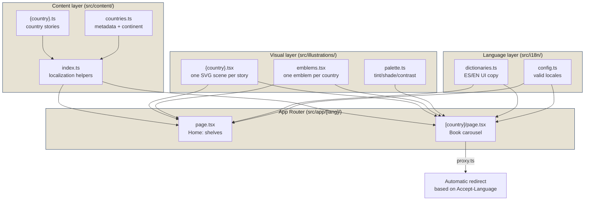

<div align="center">

# 📖 The Culture Atlas

**A digital culture atlas, country by country, page by page.**

An interactive illustrated book where every country in the world has its own "shelf": a cover, a spine with its emblem, and pages with short stories about its culture — food, traditions, music, places, curiosities — each paired with a hand-drawn SVG illustration.

[](https://nextjs.org)
[](https://react.dev)
[](https://www.typescriptlang.org)
[](https://mui.com)
[](#-internationalization)

</div>

---

## 🧭 Table of contents

- [What is this?](#-what-is-this)
- [What the experience looks like](#-what-the-experience-looks-like)
- [Tech stack](#-tech-stack)
- [Architecture](#-architecture)
- [Project structure](#-project-structure)
- [Content model](#-content-model)
- [Illustration system](#-illustration-system)
- [Quick-facts card](#-quick-facts-card)
- [Internationalization](#-internationalization)
- [How to add a new country](#-how-to-add-a-new-country)
- [Getting started](#-getting-started)
- [Audits, CI, error handling, and accessibility](#-audits-ci-error-handling-and-accessibility)
- [Git workflow and deployment](#-git-workflow-and-deployment)

---

## 📚 What is this?

**The Culture Atlas** is a website that presents the world as a library: every country is a book on a shelf, grouped by continent. Opening a country feels like paging through a real book — a cover, then pages — where each page tells a short story about some facet of its culture, paired with a full-page illustration.

The atlas covers all **206 countries and territories** in the world, each with a number of stories assigned by **tier (12, 15, or 20)** based on relevance and available material, fully bilingual (ES/EN) with original illustrations throughout.

> ⚠️ Content is generated with AI assistance and may contain inaccuracies — it doesn't replace verified sources. This notice is also shown in the site footer.

## 🖼️ What the experience looks like

```
┌─────────────────────────────┐        ┌──────────────────────────────────────────┐
│           Home page          │        │              Country page                  │
│                               │  click │                                            │
│   ✦ Shelves by continent      │ ─────▶ │  ┌───────────┐  ┌────────────────────┐    │
│   🇦🇷 🇧🇷 🇫🇷 🇯🇵 🇰🇪 ...        │        │  │           │  │  Chip · Title       │    │
│   Country search              │        │  │  SVG      │  │  Short description  │    │
│                               │        │  │  scene    │  │  Page #             │    │
└─────────────────────────────┘        │  └───────────┘  └────────────────────┘    │
                                         │        ◀  book-style carousel  ▶           │
                                         └──────────────────────────────────────────┘
```

- **Home (`/[lang]`)** — shelves (`ShelfRow`) grouped by continent, with a search box (`CountrySearch`) and quick-navigation chips (`ContinentChips`). Each country renders as a 3D book spine (`BookCover`) with its own accent color and emblem.
- **Country page (`/[lang]/[country]`)** — a carousel (`BookCarousel`, built on [Embla Carousel](https://www.embla-carousel.com/)) that simulates turning the pages of a book: first the cover (`CoverPage`), then one page per story (`PageSpread`), illustration on the left, text on the right.

## 🛠️ Tech stack

| Category | Technology | Used for |
|---|---|---|
| Framework | [Next.js 16](https://nextjs.org) (App Router) | Dynamic routes `[lang]/[country]`, static generation (`generateStaticParams`), dynamic metadata |
| UI | [React 19](https://react.dev) | Server and client components |
| Language | [TypeScript 5](https://www.typescriptlang.org) | Strict typing for content, illustrations, and i18n |
| Design | [MUI 9](https://mui.com) + Emotion | Component system, theming, `sx` prop |
| Typography | `next/font` — Geist, Geist Mono, Fraunces | Serif (Fraunces) for headings, sans for body copy |
| Carousel | [Embla Carousel](https://www.embla-carousel.com/) | The "page turn" effect on country pages |
| Illustrations | Hand-drawn SVG in React (no external libraries) | One unique scene per story, plus one emblem per country |
| i18n | Custom implementation (no library) | Static ES/EN dictionaries + language-detection middleware |
| Testing | Jest + React Testing Library, Cypress | Component tests and end-to-end browser tests (see [Audits, CI, error handling, and accessibility](#-audits-ci-error-handling-and-accessibility)) |
| Lint | ESLint 9 (`eslint-config-next`) | — |
| Deploy | [Vercel](https://vercel.com) | `metadataBase` points at `the-culture-atlas.vercel.app` |

There's no database or CMS: **all content lives in the repo as typed TypeScript code**, which turns adding a country into an "add some files" operation rather than an infrastructure-management one.

## 🏗️ Architecture

The project follows a **typed static content + independent layers** architecture, where the layers only combine at render time:



**Key principles:**

1. **Content and illustrations are decoupled by naming convention**, not direct reference. `PageSpread` looks up a story's illustration via `getIllustration(countrySlug, entryId)` — if it doesn't exist, it falls back to a placeholder emoji. This lets content ship without being blocked on art.
2. **Everything is server-side and static by default.** Pages use `generateStaticParams` to pre-render every language × country combination at build time; only the interactive components (carousel, search, language switcher) are `"use client"`.
3. **Color is the design's connective thread.** Every story has its own `accentColor`; `src/illustrations/palette.ts` derives tints, shades, and readable text color (WCAG-ish, via YIQ brightness) from that single color, with no per-component hardcoded palettes.
4. **Language is never detected client-side.** `src/proxy.ts` intercepts every request, reads the `Accept-Language` header, and redirects to `/es` or `/en` before anything renders.

## 🗂️ Project structure

```
src/
├── app/
│   ├── sitemap.ts                # sitemap.xml (every page × locale, with hreflang)
│   ├── robots.ts                 # robots.txt, points at the sitemap
│   └── [lang]/
│       ├── layout.tsx           # Shell: fonts, header, footer, MUI theme
│       ├── page.tsx             # Home: shelves by continent
│       ├── [country]/page.tsx   # A country's book carousel
│       ├── opengraph-image.tsx  # Dynamic OG image
│       └── icon.tsx / apple-icon.tsx
│
├── components/                  # UI components (MUI)
│   ├── BookCarousel.tsx         # "Page turn" carousel (Embla)
│   ├── BookCover.tsx            # 3D book spine on the shelf
│   ├── BookPageFrame.tsx        # Shared page frame
│   ├── CoverPage.tsx            # A country's book cover
│   ├── PageSpread.tsx           # One story (illustration + text)
│   ├── ShelfRow.tsx             # Horizontally-scrolling shelf
│   ├── ContinentChips.tsx       # Quick navigation by continent
│   ├── CountrySearch.tsx        # Country search box
│   ├── LanguageSwitcher.tsx     # ES/EN switcher
│   ├── Footer.tsx               # Project progress (countries/stories)
│   └── ThemeRegistry.tsx        # MUI + Emotion cache setup
│
├── content/                     # 🌍 One source of truth per country
│   ├── types.ts                 # CultureEntry, Country, Locale, Continent
│   ├── countries.ts             # Per-country metadata (slug, continent, flag)
│   ├── index.ts                 # Country→stories map + localization helpers
│   └── {country}.ts             # Array of CultureEntry (10 stories, ES+EN)
│
├── illustrations/
│   ├── types.ts                 # IllustrationDefinition (component + variant)
│   ├── index.ts                 # Country→illustrations map, keyed by story id
│   ├── IllustrationFrame.tsx    # Shared SVG background (ground/medallion variant)
│   ├── emblems.tsx              # One SVG emblem per country (cover/spine)
│   ├── palette.ts                # tint / shade / averageColor / readableTextColor
│   └── {country}.tsx             # SVG scenes, one per story for that country
│
├── i18n/
│   ├── config.ts                 # Valid locales + default locale
│   └── dictionaries.ts           # ES/EN UI copy
│
├── proxy.ts                      # Middleware: detects language and redirects
└── theme.ts                       # MUI theme (typography, base palette)
```

## 📦 Content model

Every country is a `src/content/{slug}.ts` file exporting an array of `CultureEntry` (10 stories as a starting floor, expanded in batches up to the country's **assigned tier — 12, 15, or 20**), each fully translated into both languages:

```ts
export const netherlands: CultureEntry[] = [
  {
    id: "fiets",                 // links to the illustration sharing this id
    order: 1,                    // order within the book
    accentColor: "#FF6B00",      // drives all of that page's theming
    imageUrl: null,              // optional real photo; falls back to the SVG illustration if null
    placeholderEmoji: "🚲",       // fallback if there's no illustration either
    translations: {
      es: { title, subtitle, description, imageAlt },
      en: { title, subtitle, description, imageAlt },
    },
  },
  // ...remaining stories, up to the country's assigned tier
];
```

That country is then registered in two more places:

- **`src/content/countries.ts`** — lightweight metadata (slug, `flagEmoji`, `accentColor`, `continent`, translated name and intro).
- **`src/content/index.ts`** — imported and added to the `contentByCountry` map.

> 📏 **Content constraints** (so the fixed-height pages never break visually): titles ≤55 characters, descriptions ideally under 850 characters (hard cap 1000). See the repo's `illustrations` skill for details and the audit script.

## 🎨 Illustration system

Scenes use no images or external icon libraries: **every story has its own hand-written SVG illustration** as a React component in `src/illustrations/{country}.tsx`, sharing an `id` with its story in `content/`.

- `IllustrationFrame` draws the shared background (two variants: `ground` — floor/horizon, or `medallion` — centered circle) using tints derived from that story's `accentColor`.
- `palette.ts` centralizes all color logic: `tint`/`shade` (blend toward white/black in HSL space), `readableTextColor` (readable white or black based on YIQ brightness), and `averageColor` (used for each continent shelf's color).
- `emblems.tsx` also holds **one emblem per country** (not per story), used on the book spine and cover.

If a story doesn't have an illustration yet, `PageSpread` automatically falls back to that entry's `placeholderEmoji` — content is never blocked waiting on art.

## 📇 Quick-facts card

Every country's cover (`CoverPage.tsx`) can show a small 2×2 grid with **capital, language, population, and currency**, below the emblem on desktop and as a list on mobile. It's an optional field meant to be filled in batches, same as the illustrations:

```ts
export type CountryTranslation = {
  name: string;
  intro: string;
  capital?: string;   // translatable: "Ámsterdam" / "Amsterdam"
  language?: string;  // translatable: "Neerlandés" / "Dutch"
  currency?: string;  // translatable: "Euro (€)" / "Euro (€)"
};

export type Country = {
  // ...
  population?: number; // not translatable; formatted per locale at render time
};
```

- **All or nothing**: `CoverPage` only renders the grid if the country has all four fields (`capital`, `language`, `population`, `currency`) — never a partial card.
- **Fixed width, dynamic type size**: the grid uses a constant width (it never shrinks or grows with content), and a value's font size automatically steps down for longer text (over 16 or 26 characters) so nothing ever wraps past two lines — the same pattern `PageSpread.tsx` already uses for long descriptions.
- Population is formatted with a locale-aware thousands separator via `src/i18n/format.ts` (`formatNumber`), also reused in the `Footer`.
- All **206 loaded countries/territories already have a complete quick-facts card.**

## 🌐 Internationalization

The site is bilingual (**es** by default, **en**) with no i18n library:

- Every route lives under `/[lang]/...`, validated against `src/i18n/config.ts`.
- `src/proxy.ts` (Next.js middleware) redirects `/` based on the browser's `Accept-Language` header.
- UI copy lives in `src/i18n/dictionaries.ts`; each country/story's content carries its own embedded translation (`translations.es` / `translations.en`) in its `content/` file.
- `localizeCountry` / `localizeEntry` (in `content/index.ts`) flatten those translations into the active locale before they reach any component.

## ➕ How to add a new country

1. Create `src/content/{slug}.ts` with **exactly 10** `CultureEntry` objects, in ES and EN, respecting the length limits.
2. Register the country in `src/content/countries.ts` (slug, flag, continent, color, translated name/intro, **and the quick-facts card**: `population` at the country level, plus `capital`/`language`/`currency` inside each translation — see [Quick-facts card](#-quick-facts-card)).
3. Import it in `src/content/index.ts` and add it to the `contentByCountry` map.
4. Create `src/illustrations/{slug}.tsx` with one SVG scene per story (matching `id`s), and add a new, visually distinct emblem in `emblems.tsx`.
5. Register the illustrations in `src/illustrations/index.ts`.

Everything else (routes, `generateStaticParams`, home-page shelves, the footer counter) derives automatically from those files — no routes or UI components need to change.

> 💡 There's a Claude Code skill (`.claude/skills/illustrations/SKILL.md`) with the full standard, known gotchas, and the progress tracker for this workflow.

## 🚀 Getting started

```bash
npm install
npm run dev       # http://localhost:3000
```

| Script | What it does |
|---|---|
| `npm run dev` | Development server (Turbopack) |
| `npm run build` | Production build (Webpack) |
| `npm run start` | Serves the production build |
| `npm run lint` | ESLint across the whole project |
| `npm run audit` | Runs the 4 content/illustration audits (see below) |
| `npm run cy:open` | Opens Cypress interactively (requires `npm run dev` running) |
| `npm run e2e` | Builds and serves the production app, then runs the Cypress E2E suite headlessly (see below) |
| `npm run test` | Runs component tests with Jest + React Testing Library |
| `npm run test:watch` | Same, in watch mode |

> This project runs a version of Next.js with API changes relative to what you may know — before touching code, `AGENTS.md` points to `node_modules/next/dist/docs/` for the conventions currently in effect.

## 🔍 Audits, CI, error handling, and accessibility

With 206 countries and ~3100 stories written and edited in batches, a handful of bugs kept recurring mechanically (a story `id` that doesn't match its illustration, a duplicate React key from a mis-indexed `.map`, white text on a pale `accentColor`). Instead of catching them by hand, each pattern became an audit script that runs on every push:

| Script | What it checks |
|---|---|
| `npm run audit:ids` | Every `id` in `content/{country}.ts` has a matching illustration registered in `illustrations/index.ts`, and vice versa |
| `npm run audit:lengths` | Titles ≤55 and descriptions ≤1000 characters, across all 3096 entries |
| `npm run audit:duplicate-keys` | No illustration renders two elements with the same React `key` (a real bug found 12 times, always a `.map` keyed on a single repeating coordinate or color) |
| `npm run audit:contrast` | Subtitle-chip text stays readable (`readableTextColor`) against every `accentColor` in use |

In addition:
- `cypress/e2e/*.cy.ts` covers end-to-end browser behavior: locale redirect/switching, country search, book-carousel navigation, and the 404 pages (localized and global).
- Component tests with Jest + React Testing Library (`src/**/*.test.{ts,tsx}`, colocated next to the code they test) cover reusable pure logic — `palette.ts` (tint/shade/contrast), `format.ts`, the localization helpers in `content/index.ts` — and the interactive client components (`CountrySearch`, `ContinentChips`, `LanguageSwitcher`). Jest doesn't yet run the async Server Components (the pages themselves) — that's exactly what the Cypress suite above covers.

`.github/workflows/ci.yml` runs: generate route types (`next typegen` — Next's `PageProps`/`LayoutProps` helpers don't exist on a fresh checkout otherwise) → typecheck (app and Cypress separately, each with its own `tsconfig.json`, since Cypress's and Jest's global types collide if they share one program) → lint → `npm run audit` → component tests (Jest) → build → E2E tests (Cypress), on every push and PR to `main`.

**Accessibility:** all 208 hand-drawn SVG illustrations (one per story) get `role="img"` + `aria-label` sourced from each entry's `imageAlt` field, which previously was only wired up for the real-photo (`imageUrl`) fallback path, never the SVG. The three cover/spine `<Emblem>` render sites get `aria-hidden="true"`, since they're purely decorative next to the country name, which is already an `<h1>`.

**Error handling:** since the root layout lives at `app/[lang]/layout.tsx` (a dynamic segment, not a fixed layout), two levels of error pages are needed:

- `app/[lang]/not-found.tsx` and `app/[lang]/error.tsx` — a nonexistent country or a render error under a valid language; rendered inside the site's normal header/footer, detecting the locale via `usePathname` (Next's special files don't receive `params`).
- `app/global-not-found.tsx` and `app/global-error.tsx` — cover URLs that don't match any route shape at all (e.g. `/a/b/c`), where there's no segment tree to render a layout from; they define their own bilingual `<html>`/`<body>`. Requires the `experimental.globalNotFound` flag in `next.config.ts`.
- `src/proxy.ts` only excludes `_next` and the two real dotted routes at the app root (`robots.txt`, `sitemap.xml`) from the locale redirect — everything else, including a bot-style extensioned path like `/foo.php`, still gets a locale prefix first. That matters: `app/[lang]/layout.tsx` is the site's root layout (there's no `app/layout.tsx` above it) and itself calls `notFound()` for an invalid `lang`, so if a request like `/foo.php` reached it directly with no locale, the layout would fail to render before any custom not-found UI has anywhere to mount, and Next falls back to its own generic 404 instead of ours. Redirecting first keeps `lang` always valid by the time the layout runs, so an unknown segment after it (`/es/foo.php`) fails at the page level instead, where the custom 404 renders normally.

## 🔀 Git workflow and deployment

This is a solo project, developed with direct pushes to `main` rather than a branch-per-task/PR workflow — deliberately, to keep iteration speed high on a one-person repo.

GitHub Actions and Vercel are two independent systems that both react to a push to `main`, in parallel — Vercel doesn't wait on CI:

```
push to main ──┬─→ GitHub Actions runs the CI job (typecheck, lint, audits, tests, build, E2E)
               └─→ Vercel builds and deploys to production
```

CI here is a **safety net, not a gate**: it surfaces a red ✗ on the commit if something's broken, but it doesn't block or roll back a Vercel deploy that happened in parallel. That trade-off is intentional for a single-maintainer repo — the overhead of branch protection and required PR reviews pays off on a team, where it stops one person's mistake from reaching main unreviewed; here, the same person writes and would review the code, so the friction isn't worth it. On a team project, the natural next step would be branch protection requiring the `verify` check before merging, so CI failures block production instead of just flagging it after the fact.

---

<div align="center">

Made in Buenos Aires, Argentina 🇦🇷

</div>
